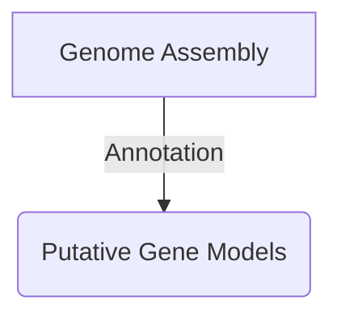
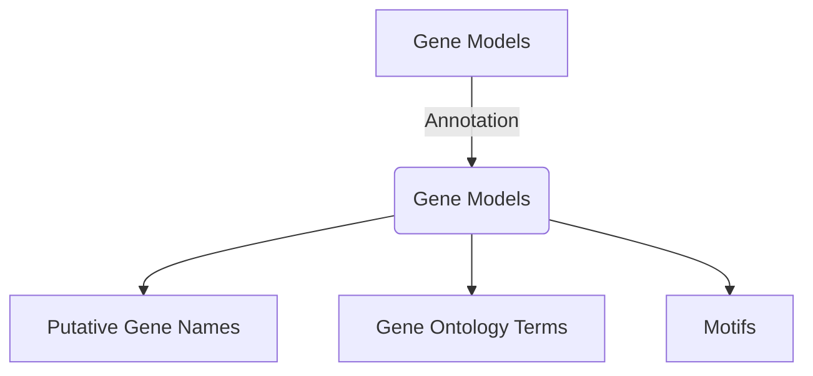

# About This Book

As genome assemblies become more routine in everyday lab tasks, it is important to understand how to quickly do a good annotation for the assembly, as predicted gene models can affect many downstream analyses (RNA-Seq, Phylogenomics, etc).

Genome annotation is a rapidly changing field, with new pipelines, tools, methods, and techniques released with somewhat regular frequently. It is not a solved problem at this stage.

Further, we explore how to examine the quality of genome annotation gene models.

## Updates
As this field is always changing, this book is a work-in-progress. It should be considered pre-release alpha at this stage.

## Genome Annotation

Annotation can mean multiple things. Here Genome Annotation is the annotation to find gene models for the sequence of the assembly. Separately, annotation of the gene models (rather than the assembly) is what we use to give gene names, GO categories, and other metadata. Please refer to the diagrams below.

## Non-Gene Annotations
New tools and databases have made it easier to annotate other important genomic features, such as repeats, transposable elements, long non-coding RNA (lncRNA), and others. These will be touched on as well.

