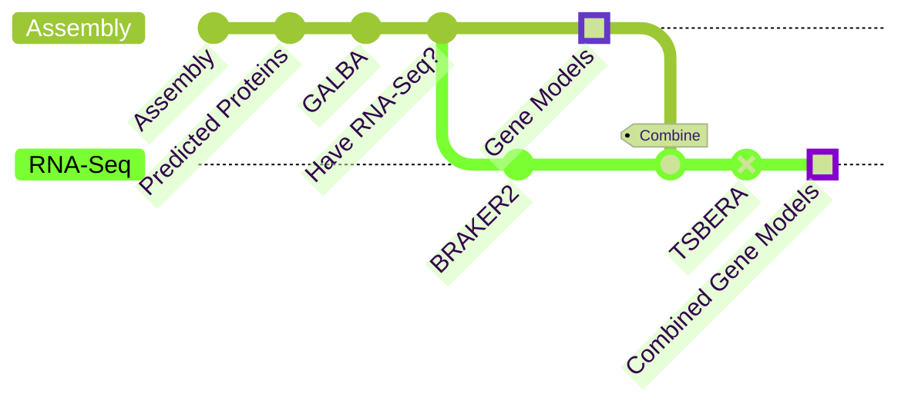

# Quick Guide

## What data do you have?



The best tools at this time, from my experience, and proven by QC checks, are [GALBA](https://github.com/Gaius-Augustus/GALBA) and [BRAKER2](https://github.com/Gaius-Augustus/BRAKER) (soon BRAKER3).

# Table of Contents
<!-- toc -->

## GALBA

GALBA does not take RNA-Seq nor transcripts as input, but only other gene models. You should use UniProt Swiss-Prot and, if available, a high-quality proteome from a related species (such as *Arabidopsis thaliana* for eudicots, for example). 

### Checklist
The following are assumed

* Eukaryotic Assembly
* Assembly is soft-masked
* Contig/scaffold names are simple (no spaces, unusual characters, etc)

### Download and Install GALBA
#### Singularity
```shell
singularity build galba.sif docker://katharinahoff/galba-notebook:devel
```

### Download UniProt SwissProt
```shell
wget https://ftp.uniprot.org/pub/databases/uniprot/current_release/knowledgebase/complete/uniprot_sprot.fasta.gz
md5sum uniprot_sprot.fasta.gz > uniprot.md5sum
date > uniprot.download_date
gunzip uniprot_sprot.fasta.gz
```

### Download any other HighQuality Proteome(s)

Once done, add them all to a single file
```shell
cat uniprot_sprot.fasta > proteins.fasta
cat OTHER_FILE.fasta >> proteins.fasta
```

### Run GALBA
```shell
singularity run galba.sif galba.pl --version > galba.version
singularity exec --bind .:/data galba.sif galba.pl \
        --species="Myspecies Name" \
        --genome="/data/assembly.fa" \
        --prot_seq=/data/proteins.fa \
        --AUGUSTUS_ab_initio \
        --threads 8 \
        --softmasking \
        --workingdir=/data/galba \
        --gff3 \
        --crf
```

To additionally create an annotation without protein evidence, add 
```shell
```
to the command.

## BRAKER2

coming soon

## Quality Control

### BUSCO
BUSCO is a good check for single-copy orthologs, but is not a good metric for other gene models. However, it is a fast, necessary, first-step in QC. It should be close to the results for the genomic BUSCO (-m genome). BUSCO overpredicts when using metaeuk, and thus you should use --augustus when possible for genomic BUSCO runs, along with the (most appropriate) --augustus_species.

#### Install BUSCO
##### Singularity
```shell
singularity build busco_5.4.4_cv1.sif docker://ezlabgva/busco:v5.4.4_cv1
```

#### Run BUSCO in Proteome Mode
```shell
singularity exec busco_5.4.4_cv1.sif busco --version > busco.version

singularity exec --bind .:/data ../busco_5.4.4_cv1.sif busco \
	-m protein -i /data/galba/augustus.hints.aa \
	-o /data/buscos/busco_galba_augustus_hints \
	--auto-lineage-euk \
	--cpu 16
```

Replace --auto-lineage-euk with -l aves or the name of the BUSCO database you wish to compare to.

### GeneValidator
GeneValidator compares multiple metrics to a known-good database. For this it is best to use your newly downloaded UniProt Swiss-Prot database, and to not include other proteomes you may have added.

#### Installation
Please see the (GitHub page)[https://github.com/wurmlab/genevalidator].

#### Running GeneValidator
Running time is usually a few days for 30k proteins.

```shell
genevalidator --version > genevalidator.version
genevalidator -d uniprot_sprot.fasta --num_threads 32 -m 8 \
        -o genevalidator/galba_uniprot_augustus_hints \
        galba/augustus.hints.aa
```

You can additionally run it against the high-quality proteomes you have downloaded:
```shell
genevalidator -d other_genome_file.fasta --num_threads 32 -m 8 \
        -o genevalidator/galba_SPECIESNAME_augustus_hints \
        galba/augustus.hints.aa
```

#### Interpretation
There are multiple files to interpret, but the main file will be **augustus.hints_summary.csv**.

The output will look similar to:
```csv
num_predictions,31842
num_good_predictions,8327
num_bad_predictions,21164
num_predictions_with_insufficient_blast_hits,6259
first_quartile_of_scores,22.0
second_quartile_of_scores,67.0
third_quartile_of_scores,90.0
```
(Note: These numbers do not add up because they are obfuscated from an upcoming paper).

A poorer genome annotation could look something like this:
```csv
num_predictions,18294
num_good_predictions,4218
num_bad_predictions,16731
num_predictions_with_insufficient_blast_hits,5925
first_quartile_of_scores,0.0
second_quartile_of_scores,45.0
third_quartile_of_scores,67.0
```

Where the number of good predictions is much lower, and the score quartiles are generally lower as well.

GeneValidator gives results such as this (See: **augustus3_results.csv**):
```csv
AnalysisNumber,GVScore,Identifier,NumberOfHits,LengthCluster,LengthRank,GeneMerge,Duplication,MissingExtraSequences
1,67,g1.t1,234,1172 [559 - 1134],1% (too long),0.1,1.0,96% conserved; 18% extra; 3% missing.
2,0,g2.t1,4,Not enough evidence,Not enough evidence,Not enough evidence,Not enough evidence,Not enough evidence
3,64,g3.t1,28,223 [190 - 509],11% (too short),-0.1,1.0,91% conserved; 0% extra; 25% missing.
4,45,g4.t1,6,337 [407 - 464],0% (too short),0.0,1.0,Not enough evidence
5,45,g5.t1,163,379 [460 - 500],5% (too short),0.0,1.0,88% conserved; 2% extra; 24% missing.
```

Easier to view in the table below:

| GVScore | NumberOfHits | LengthCluster | LengthRank | GeneMerge | Duplication | MissingExtraSequences |
| ---- | ---- | ---- | ---- | ---- | ----| ---- |
|67|234|1172 [559 - 1134]|1% (too long)|0.1|1.0|96% conserved; 18% extra; 3% missing|
|0|4|Not enough evidence|Not enough evidence|Not enough evidence|Not enough evidence|Not enough evidence|
|64|28|223 [190 - 509]|11% (too short)|-0.1|1.0|91% conserved; 0% extra; 25% missing|
|45|6|337 [407 - 464]|0% (too short)|0.0|1.0|Not enough evidence|
|45|163|379 [460 - 500]|5% (too short)|0.0|1.0|88% conserved; 2% extra; 24% missing|

As you can see, GeneValidator looks for gene models fitting an expected length distribution, gene merges, duplication, as well as extra sequence and missing sequence. As Swiss-Prot is a manually annotated list of "known-good" protein models, it is a high-quality source to check against.

# Gene Model Annotation

## EggNOG
EggNOG is the fastest way to get from gene models to gene names and GO terms. 

### Installation
...coming soon...

### Running
...coming soon...

# Notes

## Why the .version files?
This makes it easier to track which version of a tool you used for an analysis, to put into your manuscript methods (or supplemental), and increase the reproducibility of the research.

# Final

With these QC scores (BUSCO and GeneValidator), you should be able to tell the quality of your annotation and should now, quickly, have a workable annotation. Depending on your use case, there are a multitude of ways to improve the gene models, including additional RNA-Seq, or adding proteins of interest from related organisms you know to be high-quality to your protein input into the file (as opposed to entire proteomes from other species). 

For further gene model annotation, please see the appropriate chapter in this book.

If higher-quality annotations are required, please read the rest of this guide!

